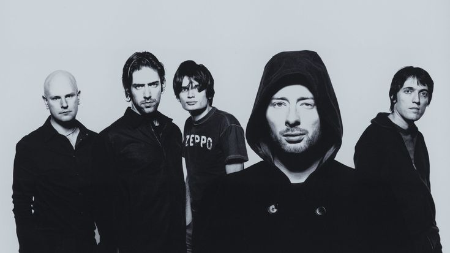
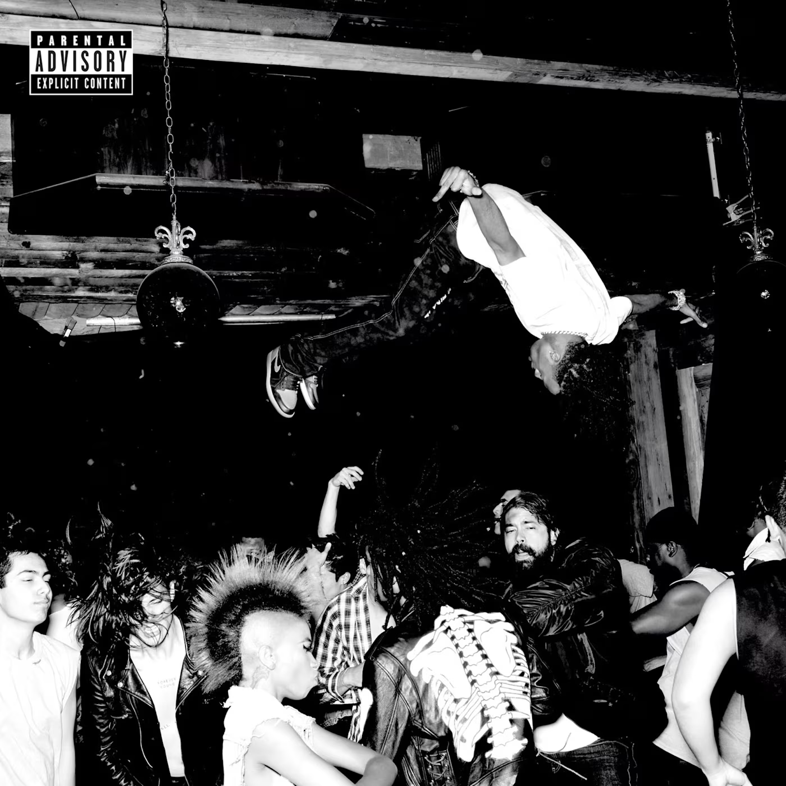
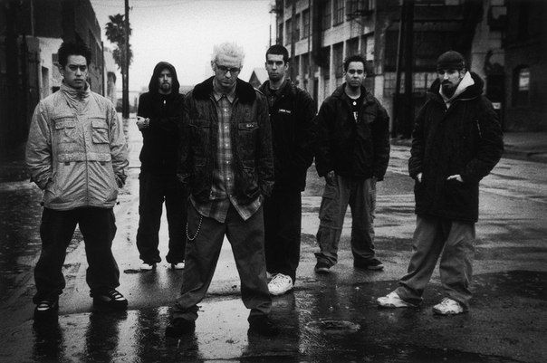

# Who I Am

I am a **Computer Science and Engineering undergraduate specializing in Artificial Intelligence**, building AI-powered solutions and machine learning models.

Passionate about: **AI/ML** &bull; **Esports IGL** &bull; **Cinema** &bull; **Music**

---

## Tech Stack & Tools

### Generative AI, LLMs & Agents

  
  
  
  
  
  

### Databases & Vector Stores

  
  
  
  

### Cloud, Containers & Deployment

  
  
  

### Core Languages & Development Environment

  
  
  
  
  

---

## Music That Shaped Me

> *The artists I grew up with, inspired by, and found clarity in.*

<!-- Row 1: Radiohead, Playboi Carti, Linkin Park -->
<table width="100%">
  <tr>
    <td width="33.3%" align="center" valign="top">
      
        
      <b>Radiohead</b>
       
      <em>OK Computer / Kid A monochrome band portrait</em>
        
      "For a minute there, I lost myself, I lost myself."
    </td>
    <td width="33.3%" align="center" valign="top">
      
        
      <b>Playboi Carti</b>
       
      <em>Die Lit stage-dive monochrome cover</em>
        
      "They can't understand me, I'm talking hieroglyphics."
    </td>
    <td width="33.3%" align="center" valign="top">
      
        
      <b>Linkin Park</b>
       
      <em>Hybrid Theory era street portrait</em>
        
      "I tried so hard and got so far, but in the end, it doesn't even matter."
    </td>
  </tr>
</table>

<!-- Row 2: J. Cole, XXXTentacion -->
<table width="100%">
  <tr>
    <td width="50%" align="center" valign="top">
      
        
      <b>J. Cole</b>
       
      <em>The Off-Season studio session</em>
        
      "There's beauty in the struggle, ugliness in the success."
    </td>
    <td width="50%" align="center" valign="top">
      
        
      <b>XXXTentacion</b>
       
      <em>SKINS / 17 split-dreads portrait</em>
        
      "What is real will prosper."
    </td>
  </tr>
</table>

---

## Live Audio Stream // Spotify

<!-- Heavy Rotation Banner / Sonic Signature -->

  

<!-- Live Spotify Now Playing Card -->

  

---

## GitHub Stats

  

---

## Connect

  

